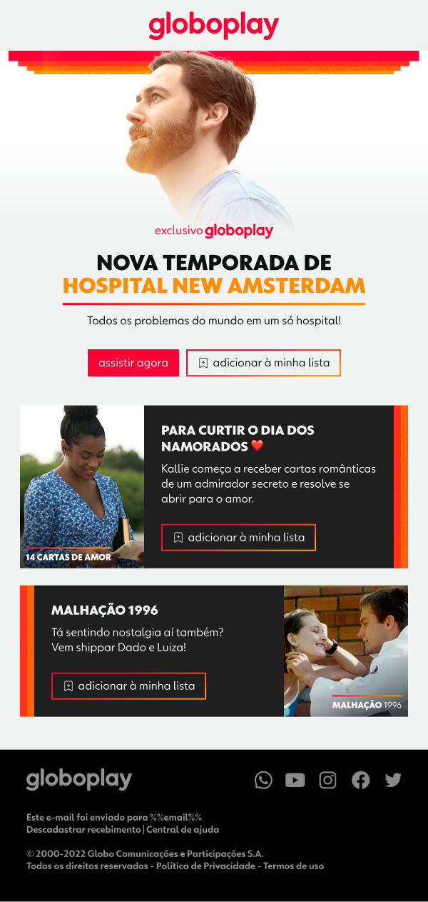

# Teste desenvolvedor jr

## Seja um VXzeiro!

Estamos no mercado desde 2002, e nosso QG está localizado na cidade de Niterói. Somos uma agência 360 e temos vários cases legais (<a href="https://vxcomunicacao.com.br/todos-cases/" target="_blank">clique aqui</a> para conhecer alguns).

Acreditamos no trabalho duro, amamos o que fazemos e somos incansáveis na missão de cultivar relações interpessoais transparentes, duradouras e produtivas.

Nosso DNA está baseado em criar soluções que convertam sempre com muita criatividade, pensando fora da caixa e dentro do budget.

O que buscamos neste teste é tentar conhecer melhor o seu trabalho.

## Objetivos

Preparamos um layout de um email marketing e você precisa montar seguindo o modelo.

## O que esperamos no teste

* Uso de CSS inline;
* Uso de texto no lugar de imagens sempre que possível;
* Uso de tabelas (`<table>`);
* Versionamento.

## Informações extras

* Use marcações compátiveis com a maioria dos clientes de e-mail do mercado. 

* Não usar `padding` nos espaçamentos.

* No figma, faça a importação do arquivo **newsletter.fig** para obter informações sobre o layout e recorte de imagens.

* A fonte **Globotipo Texto** utilizada no layout deve ser importada através do <a href="https://cdn.jsdelivr.net/gh/viniciusvasc13/globoplay@master/globotipo2.css" target="_blank">**JSDelivr**</a>.

## Como enviar os arquivos? 

1. Faça o `clone` do projeto `git clone https://github.com/vx-comunicacao/desenvolvedor-jr`
2. Crie uma `branch` com suas alterações
3. Faça um `README.md` falando um pouco de você e porque você gostaria de trabalhar aqui na VX.
4. Nos envie o link.

## Modelo 

**Boa sorte!**

